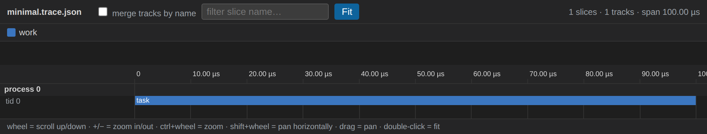
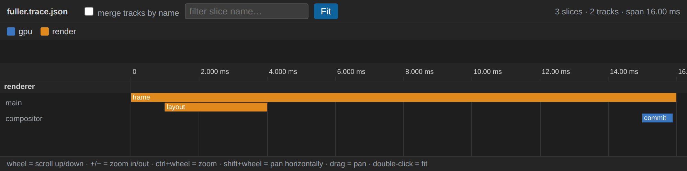

# Trace format

Simple Trace reads the **Chrome Trace Event Format** (the JSON format used by
`chrome://tracing`, Perfetto, and many profilers). This document defines
exactly which parts of that format Simple Trace understands, how each field is
interpreted, and what is ignored.

If you are generating traces yourself, following this document guarantees they
render correctly.

## Top-level structure

The file is UTF-8 JSON in one of two shapes.

Object form (recommended):

```json
{
  "traceEvents": [ /* array of event objects */ ],
  "displayTimeUnit": "ms"
}
```

Array form (also accepted):

```json
[ /* array of event objects */ ]
```

| Field             | Type   | Required | Notes                                                            |
| ----------------- | ------ | -------- | ---------------------------------------------------------------- |
| `traceEvents`     | array  | yes\*    | The list of event objects. \*Required in object form.            |
| `displayTimeUnit` | string | no       | `"ms"` or `"ns"`. Currently informational; see [Units](#units).  |

Any other top-level fields (for example `metadata`, `otherData`) are ignored.

## Event object

Every element of `traceEvents` is an object. The fields Simple Trace reads:

| Field  | Type            | Meaning                                                                 |
| ------ | --------------- | ----------------------------------------------------------------------- |
| `ph`   | string          | Phase (event type). Determines how the event is handled. See below.     |
| `name` | string          | Display name of the slice.                                              |
| `cat`  | string          | Category. Drives slice color and the legend. Optional.                  |
| `pid`  | number / string | Process id. Groups tracks. Defaults to `0` if omitted.                  |
| `tid`  | number / string | Thread id. Identifies the track within a process. Defaults to `0`.      |
| `ts`   | number          | Start timestamp, in microseconds. See [Units](#units).                  |
| `dur`  | number          | Duration, in microseconds (used by `X` events).                         |
| `args` | object          | Arbitrary key/value metadata shown in the slice tooltip. Optional.      |

## Supported phases (`ph`)

Simple Trace implements the subset needed to draw a timeline of durations.

### `X` — complete event

A single slice with an explicit start and duration. This is the primary and
recommended event type.

```json
{ "name": "compute", "cat": "kernel", "ph": "X", "pid": 0, "tid": 3, "ts": 120.5, "dur": 42.0, "args": { "size": 4096 } }
```

- Drawn from `ts` to `ts + dur` on the track `(pid, tid)`.
- A negative `dur` is clamped to `0`.

### `B` / `E` — begin and end

A slice expressed as two events on the same `(pid, tid)`: a begin (`B`) followed
by a matching end (`E`). Begins are matched to ends as a stack (LIFO), so nested
begin/end pairs become nested slices.

```json
{ "name": "outer", "ph": "B", "pid": 0, "tid": 1, "ts": 10 }
{ "name": "inner", "ph": "B", "pid": 0, "tid": 1, "ts": 12 }
{ "name": "inner", "ph": "E", "pid": 0, "tid": 1, "ts": 18 }
{ "name": "outer", "ph": "E", "pid": 0, "tid": 1, "ts": 25 }
```

- The slice takes its `name`, `cat`, and `args` from the `B` event (falling back
  to the `E` event's `args` if the begin had none).
- An `E` with no open `B` on that track is ignored.

### `M` — metadata

Metadata events set track labels and ordering. Only these three `name` values
are used; all are optional.

| `name`               | Reads from `args` | Effect                                                        |
| -------------------- | ----------------- | ------------------------------------------------------------- |
| `process_name`       | `args.name`       | Display name for the process group (`pid`).                   |
| `thread_name`        | `args.name`       | Display name for the track (`pid`, `tid`).                    |
| `thread_sort_index`  | `args.sort_index` | Sort key for ordering tracks within a process (ascending).    |

```json
{ "name": "process_name",      "ph": "M", "pid": 0,          "args": { "name": "worker 0" } }
{ "name": "thread_name",       "ph": "M", "pid": 0, "tid": 3, "args": { "name": "stream 3" } }
{ "name": "thread_sort_index", "ph": "M", "pid": 0, "tid": 3, "args": { "sort_index": 3 } }
```

### `s` / `t` / `f` — flow events

Flow events draw **arrows between slices** to show a directed relationship such
as a producer → consumer dependency. A flow is a sequence of points that share
an `id`, in one of three phases: `s` (start), `t` (step), and `f` (finish). An
arrow is drawn between each consecutive pair of points in `ts` order.

| Field | Type            | Meaning                                                                       |
| ----- | --------------- | ----------------------------------------------------------------------------- |
| `id`  | number / string | Flow id. Points sharing an `id` (within a `cat`) form one flow. `bind_id` is also accepted. |
| `cat` | string          | Category. Colors the arrow and appears in the legend; toggle it to hide those arrows. |
| `ts`  | number          | Position of this point in time (microseconds).                                |
| `pid` / `tid` | number / string | The track the point sits on.                                          |

- Each point binds to the **enclosing slice** on its `(pid, tid)` track — the
  slice whose `[ts, ts + dur]` interval contains the flow's `ts` (this matches a
  Perfetto `"bp": "e"` flow). If no slice contains it, the point falls back to
  the track's row at that time.
- Flow ids are scoped by `cat` (the Chrome-trace convention), so different
  categories may reuse the same id.
- Arrows are colored by `cat` using the same palette as slices, and each flow
  category is listed in the legend. Hovering a slice highlights the flows that
  touch it and dims the rest; the slice tooltip shows how many flows it touches.
- Use the **flow arrows** toolbar toggle to show/hide all arrows at once.

```json
{ "name": "dep", "cat": "dep_cross_l2", "ph": "s", "id": 7, "pid": 0, "tid": 0, "ts": 10 }
{ "name": "dep", "cat": "dep_cross_l2", "ph": "f", "bp": "e", "id": 7, "pid": 0, "tid": 1, "ts": 60 }
```

See [`examples/flows.trace.json`](../examples/flows.trace.json) for a
producer→consumer fan-out with two flow categories.

### Ignored phases

The following phases are parsed without error but are **not** drawn:
instant (`i` / `I`), counter (`C`), async (`b` / `n` / `e`), sample (`P`),
object (`N` / `O` / `D`), and metadata names other than the three listed above.

## Tracks, grouping, and ordering

- A **track** is one `(pid, tid)` pair. Slices on the same track that overlap in
  time are stacked into sub-rows automatically (depth is computed from overlap).
- Tracks are grouped by **process** (`pid`), labeled using `process_name`.
- Within a process, tracks are ordered by `thread_sort_index` ascending; tracks
  without a sort index sort after those that have one, then by `tid`.
- The "merge tracks by name" toggle collapses all tracks that share the same
  `thread_name` (within a process) into a single lane.

## Categories and color

- Each distinct `cat` value gets a color, assigned from a fixed categorical
  palette in order of first appearance, with a deterministic hashed color once
  the palette is exhausted.
- Events without a `cat` are grouped under the category `(none)`.
- The legend lists every category and lets you toggle each one on or off.

## Units

- `ts` and `dur` are interpreted as **microseconds**, which is the Chrome-trace
  convention, regardless of `displayTimeUnit`.
- Axis and tooltip labels are formatted adaptively (ns / µs / ms / s) based on
  magnitude. Displayed times are relative to the earliest event in the trace.

## Minimal valid example

A single complete (`X`) slice on one track.
[`examples/minimal.trace.json`](../examples/minimal.trace.json):

```json
{
  "traceEvents": [
    { "name": "task", "cat": "work", "ph": "X", "pid": 0, "tid": 0, "ts": 0, "dur": 100 }
  ]
}
```

Rendered:



## Fuller example

Two tracks in one process, a nested `B`/`E` pair, and a slice on a second
track. [`examples/fuller.trace.json`](../examples/fuller.trace.json):

```json
{
  "displayTimeUnit": "ms",
  "traceEvents": [
    { "name": "process_name",      "ph": "M", "pid": 0,          "args": { "name": "renderer" } },
    { "name": "thread_name",       "ph": "M", "pid": 0, "tid": 0, "args": { "name": "main" } },
    { "name": "thread_sort_index", "ph": "M", "pid": 0, "tid": 0, "args": { "sort_index": 0 } },
    { "name": "thread_name",       "ph": "M", "pid": 0, "tid": 1, "args": { "name": "compositor" } },
    { "name": "thread_sort_index", "ph": "M", "pid": 0, "tid": 1, "args": { "sort_index": 1 } },

    { "name": "frame",  "cat": "render", "ph": "X", "pid": 0, "tid": 0, "ts": 0,    "dur": 16000, "args": { "frame": 1 } },
    { "name": "layout", "cat": "render", "ph": "B", "pid": 0, "tid": 0, "ts": 1000 },
    { "name": "layout", "cat": "render", "ph": "E", "pid": 0, "tid": 0, "ts": 4000 },
    { "name": "commit", "cat": "gpu",    "ph": "X", "pid": 0, "tid": 1, "ts": 15000, "dur": 900 }
  ]
}
```

Rendered. Note the `layout` `B`/`E` pair becomes a single slice, stacked on a
sub-row beneath `frame` because they overlap in time; the two threads appear as
separate tracks ordered by `thread_sort_index`:



## Reference

- Chrome Trace Event Format specification:
  <https://docs.google.com/document/d/1CvAClvFfyA5R-PhYUmn5OOQtYMH4h6I0nSsKchNAySU>
